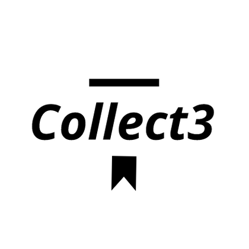

<!--
Hey, thanks for using the awesome-readme-template template.  
If you have any enhancements, then fork this project and create a pull request 
or just open an issue with the label "enhancement".

Don't forget to give this project a star for additional support ;)
Maybe you can mention me or this repo in the acknowledgements too
-->
<div align="center">

  
  <h1>Collect3.me</h1>
  
  <p>
    This is a Web3 project with the goal to save your favorite content FOREVER! 
  </p>
  
  
<!-- Badges -->
<p>
  <a href="https://github.com/8infinitelabs/collect3/graphs/contributors">
    
  </a>
  <a href="">
    
  </a>
  <a href="https://github.com/8infinitelabs/collect3/network/members">
    
  </a>
  <a href="https://github.com/8infinitelabs/collect3/stargazers">
    
  </a>
  <a href="https://github.com/8infinitelabs/collect3/issues/">
    
  </a>
  <a href="https://github.com/8infinitelabs/collect3/blob/master/LICENSE">
    
  </a>
</p>
   
<h4>
    <a href="https://collect3.me/">Website</a>
   <span> · </span>
    <a href="https://chrome.google.com/webstore/detail/collect3/afahgefgimgodpkiapdbjlcchdogfeib">Download beta</a>
  <span> · </span>
    <a href="https://github.com/8infinitelabs/collect3/issues/">Report Bug</a>
  <span> · </span>
    <a href="https://github.com/8infinitelabs/collect3/issues/">Request Feature</a>
  </h4>
</div>

<br />

<!-- Table of Contents -->
# :notebook_with_decorative_cover: Table of Contents

- [About the Project](#star2-about-the-project)
  * [Screenshots](#camera-screenshots)
  * [Tech Stack](#space_invader-tech-stack)
  * [Features](#dart-features)
  * [Color Reference](#art-color-reference)
  * [Environment Variables](#key-environment-variables)
- [Getting Started](#toolbox-getting-started)
  * [Prerequisites](#bangbang-prerequisites)
  * [Installation](#gear-installation)
  * [Running Tests](#test_tube-running-tests)
  * [Run Locally](#running-run-locally)
  * [Deployment](#triangular_flag_on_post-deployment)
- [Usage](#eyes-usage)
- [Roadmap](#compass-roadmap)
- [Contributing](#wave-contributing)
  * [Code of Conduct](#scroll-code-of-conduct)
- [FAQ](#grey_question-faq)
- [License](#warning-license)
- [Contact](#handshake-contact)
- [Acknowledgements](#gem-acknowledgements)

  

<!-- About the Project -->
## :star2: About the Project

Collect3 is a browser plugin that empowers users to eternalize digital content like articles or posts using web3 and decentralized storage. Unlike traditional bookmarks or saved PDFs, Collect3 allows users to mint and store reader-friendly versions of the content on the dex storage, ensuring permanence and true ownership and doc sharing. This solves the problem of content loss due to website changes, discontinuations, or censorship, offering a robust, decentralized solution for preserving valuable information.

<!-- Screenshots -->
### :camera: Demo

<div align="center"> 
  
</div>


<!-- TechStack -->
### :space_invader: Tech Stack

<details>
  <summary>Client</summary>
  <ul>
    <li><a href="https://www.typescriptlang.org/">Typescript</a></li>
    <li><a href="https://nextjs.org/">Next.js</a></li>
    <li><a href="https://reactjs.org/">React.js</a></li>
    <li><a href="https://tailwindcss.com/">TailwindCSS</a></li>
  </ul>
</details>

<details>
  <summary>Server</summary>
  <ul>
    <li><a href="https://www.typescriptlang.org/">Typescript</a></li>
    <li><a href="https://expressjs.com/">Express.js</a></li>
  </ul>
</details>

<details>
<summary>Database</summary>
  <ul>
    <li><a href="https://www.mongodb.com/">MongoDB</a></li>
  </ul>
</details>

<details>
<summary>DevOps</summary>
  <ul>
    <li><a href="https://www.docker.com/">Docker</a></li>
  </ul>
</details>

<!-- Features -->
### :dart: Coming Features

- Save articles as NFTs
- Keep the Articles forever storing them into Decentralized Storage
- Share your articles with other users!
- Add comments into the articles
- Read other owners comments of the same article
- Resell the articles!

<!-- Color Reference 
### :art: Color Reference

| Color             | Hex                                                                |
| ----------------- | ------------------------------------------------------------------ |
| Primary Color |  #222831 |
| Secondary Color |  #393E46 |
| Accent Color |  #00ADB5 |
| Text Color |  #EEEEEE |
-->

<!-- Env Variables 
### :key: Environment Variables

To run this project, you will need to add the following environment variables to your .env file

`API_KEY`

`ANOTHER_API_KEY`

-->

<!-- Getting Started -->
## 	:toolbox: Getting Started

<!-- Prerequisites -->
### :bangbang: Prerequisites

This project uses Yarn as package manager

```bash
 npm install --global yarn
```
<!-- Run Locally -->
### :running: Run Locally

Clone the project

```bash
  git clone https://github.com/8infinitelabs/collect3.git
```

Go to the project directory

```bash
  cd my-project/packages/extension
```

Install dependencies

```bash
  yarn install
```

Then you can build the extension
```sh
    yarn build
```
[And finally you can install it this way](https://superuser.com/questions/247651/how-does-one-install-an-extension-for-chrome-browser-from-the-local-file-system/)

or you can execute
```sh
    yarn start
```
if you are going to make changes to the code

<!-- Roadmap -->
## :compass: Roadmap

* [x] Create plugin browser
* [x] Get a Read-mode view for articles
* [x] Save them in Local Browser (temporally storage)
* [ ] Create an NFT
* [ ] Improve Read-mode view
* [ ] Store the content into decentralized storage
* [ ] Share your articles!
* [ ] Add comments into the article
* [ ] Read comments from any other article owners
* [ ] Boost article discussions
* [ ] Sell articles NFTs to other users
* [ ] Marketplace for articles


<!-- Contributing -->
## :wave: Contributing

<a href="https://github.com/8infinitelabs/collect3/graphs/contributors">
  
</a>


Contributions are always welcome!

See `contributing.md` for ways to get started.


<!-- Code of Conduct -->
### :scroll: Code of Conduct

Please read the [Code of Conduct](https://github.com/8infinitelabs/collect3/blob/master/CODE_OF_CONDUCT.md)

<!-- FAQ 
## :grey_question: FAQ

- Question 1

  + Answer 1

- Question 2

  + Answer 2

-->

<!-- License -->
## :warning: License

Distributed under the no License. See LICENSE for more information.


<!-- Contact -->
## :handshake: Contact

Diego Torres - [@twitter_handle](https://twitter.com/0xdiegotorres) - diego@infinitelabs.co

Project Link: [https://github.com/8infinitelabs/collect3](https://github.com/8infinitelabs/collect3)


<!-- Acknowledgments -->
## :gem: Acknowledgements

Use this section to mention useful resources and libraries that you have used in your projects.

 - [Shields.io](https://shields.io/)
 - [Awesome README](https://github.com/matiassingers/awesome-readme)
 - [Emoji Cheat Sheet](https://github.com/ikatyang/emoji-cheat-sheet/blob/master/README.md#travel--places)
 - [Readme Template](https://github.com/othneildrew/Best-README-Template)

