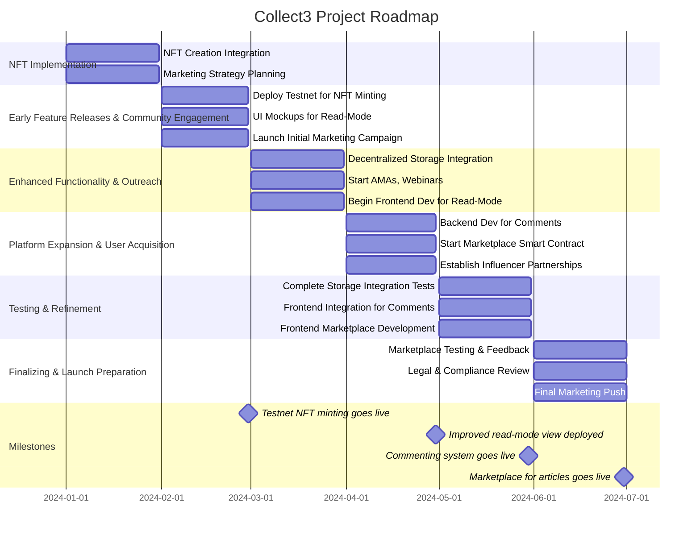

```mermaid

gantt
    dateFormat  YYYY-MM-DD
    title       Collect3 Project Roadmap

    section NFT Implementation
    NFT Creation Integration           :         nft1, 2024-01-01, 2024-01-31
    Marketing Strategy Planning        :         mkt1, 2024-01-01, 2024-01-31

    section Early Feature Releases & Community Engagement
    Deploy Testnet for NFT Minting     :         nft2, 2024-02-1, 2024-02-29
    UI Mockups for Read-Mode           :         uim1, 2024-02-1, 2024-02-29
    Launch Initial Marketing Campaign  :         mkt2, 2024-02-1, 2024-02-29

    section Enhanced Functionality & Outreach
    Decentralized Storage Integration  :         dsi1, 2024-03-1, 30d
    Start AMAs, Webinars               :         ama1, 2024-03-1, 30d
    Begin Frontend Dev for Read-Mode   :         uim2, 2024-03-1, 30d

    section Platform Expansion & User Acquisition
    Backend Dev for Comments           :         com1, 2024-04-1, 29d
    Start Marketplace Smart Contract   :         mkp1, 2024-04-1, 29d
    Establish Influencer Partnerships  :         inf1, 2024-04-1, 29d

    section Testing & Refinement
    Complete Storage Integration Tests :         dsi2, 2024-05-1, 30d
    Frontend Integration for Comments  :         com2, 2024-05-1, 30d
    Frontend Marketplace Development   :         mkp2, 2024-05-1, 30d


    section Finalizing & Launch Preparation
    Marketplace Testing & Feedback     :         mkp3, 2024-06-1, 30d
    Legal & Compliance Review          :         leg1, 2024-06-1, 30d
    Final Marketing Push               :         mkt3, 2024-06-1, 30d

    section Milestones
    Testnet NFT minting goes live       :milestone, 2024-02-29, 0d
    Improved read-mode view deployed    :milestone, 2024-04-30, 0d
    Commenting system goes live         :milestone, 2024-05-30, 0d
    Marketplace for articles goes live  :milestone, 2024-06-30, 0d

```